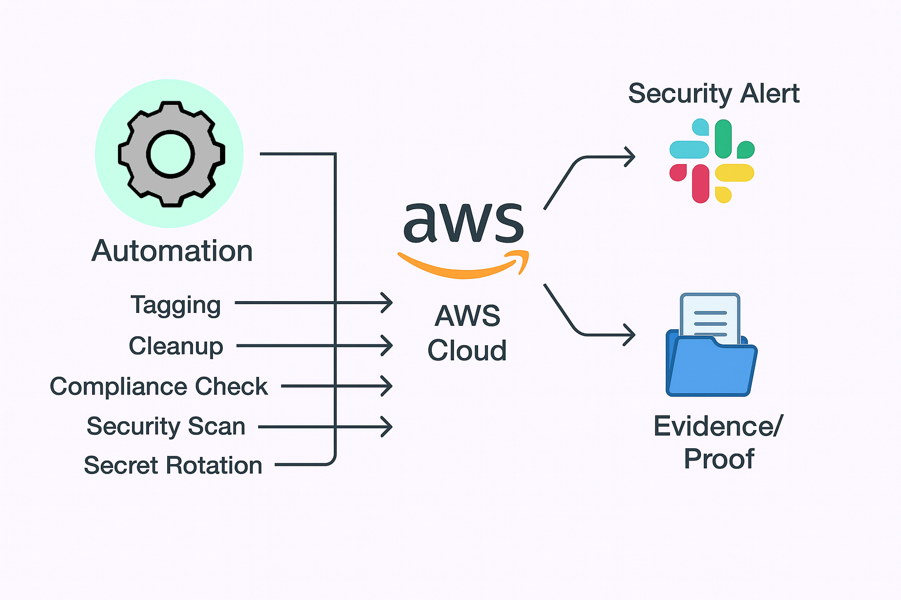
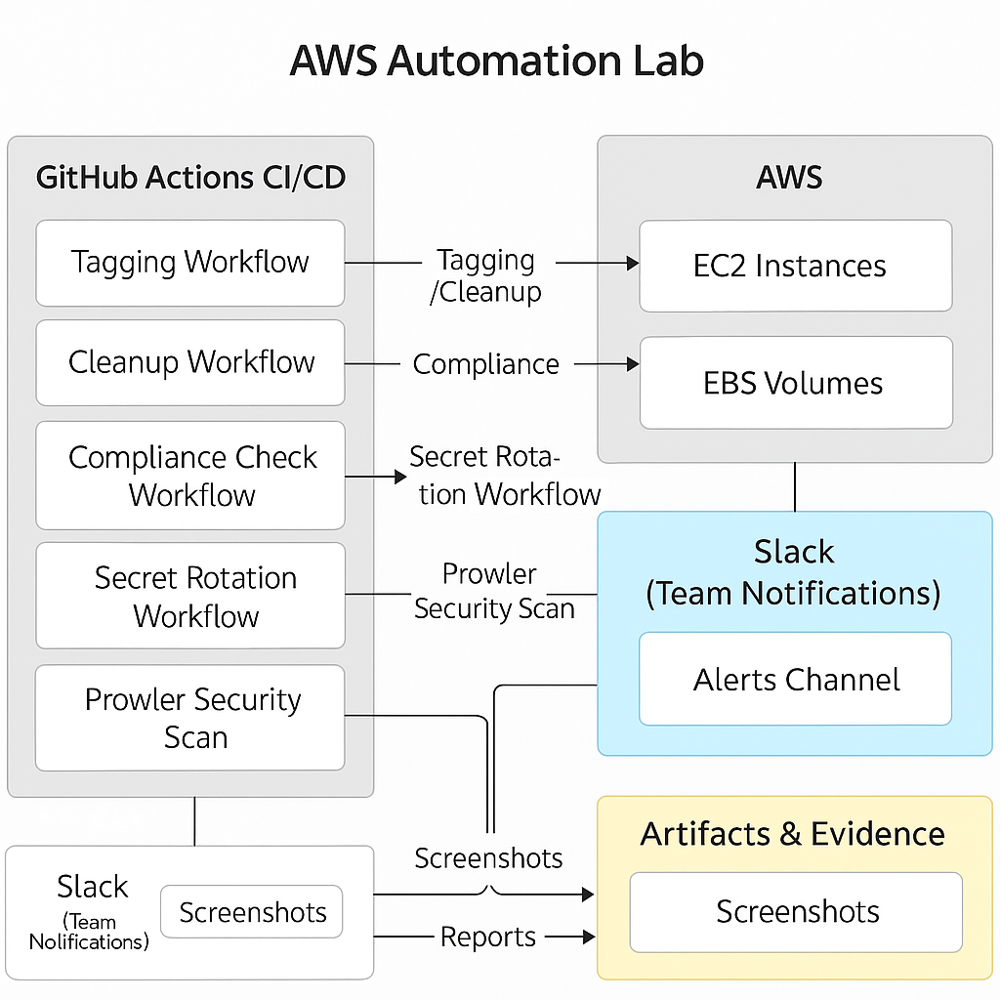

## AWS Automation Scripts Lab with Compliance, Slack Alerts and Key Rotation

Secure automation of AWS tagging, cleanup, compliance, secret rotation and security scanning—using Python, AWS CLI, open-source tools and GitHub Actions CI/CD.  

---

## Table of Contents

- [Overview](#overview)
- [Real-World Risk](#real-world-risk)
- [What I Built](#what-i-built)
- [Diagram](#diagram)
- [Objectives](#objectives)
- [Steps Performed](#steps-performed)
  - [1. Project Setup]
  - [2. Tagging Automation]
  - [3. Automated Cleanup]
- [Bonuses]
  - [1. Security Scanning with Prowler] 
  - [2. Compliance Check Automation] 
  - [3. Slack Integration & Notification]
  - [4. Secret Rotation Automation] 
  - [5. Automation as Code: GitHub Actions] 
- [Screenshots](#screenshots)
- [Lessons Learned](#lessons-learned)
- [Notes and Limitations](#notes-and-limitations)
- [References](#references)
- [Contact](#contact)

---

## Overview

This lab demonstrates secure, real-world AWS automation for:
- **Tagging and cleaning up EC2s** (cost & hygiene)
- **Compliance checks and reporting**
- **Secret rotation (IAM) and notifications**
- **Live Slack alerting for all security actions**
- **Open-source security scanning with Prowler**
- **Automated scheduling and evidence collection via GitHub Actions**

---

## Real-World Risk

Manual AWS operations lead to:
- Untagged assets and cloud spend overruns.
- Orphaned instances—wasted resources and attack surface increase.
- Non-compliant AWS resources and risk of audit/security incidents.
- Forgotten, stale IAM keys (major breach vector)
- Security misconfigurations missed by manual review.
- No team visibility: security actions can go unnoticed.

---

## What I Built

A full-stack AWS automation portfolio lab that:
- **Tags all untagged EC2s** for visibility and billing clarity.
- **Cleans up** unused stopped EC2s.

**Bonuses**
- **Runs Prowler** for industry-standard AWS security scanning.
- **Automates compliance checks** (e.g., EBS encryption), with instant Slack alerts.
- **Rotates IAM secrets and deletes old keys**, alerting the team on each action.
- **Runs everything in GitHub Actions**, with secure secrets handling.

---

## Diagram

**Simple Diagram**
 

**Detailed Diagram**
 

---

## Objectives

- Build secure, modular AWS automation for tagging, cleanup, compliance, secret rotation and reporting.
- Collect and document “proof” (screenshots, reports) of all automation steps.
- Integrate Slack and CI/CD for operational visibility.
- Use AWS security best practices and evidence-driven DevOps.

---

## Steps Performed

### 1. Project Setup & Folder Structure
   - Created a clean repo: `tagging/`, `cleanup/`, `compliance/`, `secrets/`, `screenshots/` & `reports/`.
   - Installed AWS CLI, Python 3, boto3, Prowler and configured IAM lab user with least privilege *(Screenshot: `repo_folder_structure.png`)*

### 2. Tagging Automation
   - Wrote and ran a Python script to tag untagged EC2s with a `Project: LabAutomation` tag.
   - Verified in AWS Console *(Screenshots: `tagging_script.png`, `tagging_script_execution.png` & `ec2s_after_scripts.png`)*

### 3. Automated Cleanup
   - Scripted cleanup of stopped EC2s older than 30 days (dry run for safety)
   - Showed pre/post state in AWS Console *(Screenshots: `cleanup_script.png`, `cleanup_script_execution.png` & `ec2s_after_scripts.png`)*

---

## Bonuses

### 1. Security Scanning with Prowler 
   - Ran Prowler AWS security scan and saved results *(Screenshots: `prowler_security_scan_running.png` & `prowler_security_scan_results.png`)*

### 2. Compliance Check Automation 
   - Python/boto3 script to detect unencrypted EBS volumes.
   - Integrates with Slack: sends alerts if non-compliance is found *(Screenshots: `compliance-check-script.png`, `compliance-check-terminal-output.png` & `slack-alert-message-channel.png`)*

### 3. Slack Integration & Notification
   - Created Slack app with Incoming Webhook.
   - Automated notifications from scripts (test, compliance, secret rotation) *(Screenshots: `slack-app-name-and-workspace.png`, `slack-enable-incoming-webhooks.png`, `slack-webhook-url-generated.png`, `slack-add-webhook-channel.png`, `slack-channel-message-from-script.png` & `slack-alert-message-channel.png`)*

### 4. Secret Rotation Automation 
- Python script rotates IAM user access key, deletes old key and sends Slack alert.
- Executed via GitHub Actions for auditability *(Screenshots: `secret-rotation-script.png`, `rotate-key-slack-alert.png` & `rotate-key-workflow-success.png`)*

### 5. Automation as Code: GitHub Actions 
   - All automation runs as code, scheduled/triggered in `.github/workflows/`.
   - GitHub Actions securely injects AWS/Slack secrets via encrypted secrets *(Screenshots: `github-actions-compliance-workflow-run.png`, `github-actions-compliance-yaml.png` & `rotate-key-workflow-success.png`)*

---

## Screenshots

*All screenshots are included in the `screenshots/` folder.*

| Step | Filename                                   | Description                                      |
|------|--------------------------------------------|--------------------------------------------------|
| 1    | repo_folder_structure.png                  | Folder/project structure in VS Code              |
| 2    | tagging_script.png                         | Tagging script code in editor                    |
| 2    | tagging_script_execution.png               | Tagging script output (terminal)                 |
| 2/3  | ec2s_after_scripts.png                     | EC2s after tagging/cleanup (AWS Console)         |
| 3    | cleanup_script.png                         | Cleanup script code in editor                    |
| 3    | cleanup_script_execution.png               | Cleanup script output (terminal)                 |
| 4    | prowler_security_scan_running.png          | Prowler running in terminal                      |
| 4    | prowler_security_scan_results.png          | Security findings in Prowler HTML report         |
| 5    | compliance-check-script.png                | Compliance script code (EBS encryption)          |
| 5    | compliance-check-terminal-output.png       | Compliance check output (terminal)               |
| 5    | slack-alert-message-channel.png            | Slack channel message from compliance check      |
| 6    | slack-app-name-and-workspace.png           | Slack app/workspace selection dialog             |
| 6    | slack-enable-incoming-webhooks.png         | Slack: Incoming Webhooks enabled                 |
| 6    | slack-webhook-url-generated.png            | Slack: Webhook URL generated (masked)            |
| 6    | slack-add-webhook-channel.png              | Slack: Added webhook to channel                  |
| 6    | slack-channel-message-from-script.png      | Slack alert from script (test message)           |
| 6    | slack-alert-message-channel.png            | Slack compliance alert received                  |
| 7    | secret-rotation-script.png                 | IAM key rotation script code                     |
| 7    | rotate-key-slack-alert.png                 | Slack alert after key rotation                   |
| 7/8  | rotate-key-workflow-success.png            | GitHub Actions workflow: key rotation success    |
| 8    | github-actions-compliance-workflow-run.png | Compliance workflow run in Actions               |
| 8    | github-actions-compliance-yaml.png         | Compliance workflow YAML code in GitHub Actions  |

---

## Lessons Learned

- How to use Python/boto3 for scalable AWS automation: tagging, cleanup, compliance and key rotation.
- Integrate Slack for real-time team notifications on cloud security events.
- Run everything in CI/CD (GitHub Actions) for auditability and production readiness.
- How open-source security tools (Prowler) fit into continuous cloud security.
- Portfolio/documentation matters: screenshots & evidence “show not tell” your real skills.

---

## Notes and Limitations

- Demo scripts are for learning and proof-of-concept—use dry-run and least-privilege in production.
- Some screenshots are redacted for security.
- Security scanning coverage (Prowler) can be expanded as needed.
- Slack webhooks and AWS credentials are always managed as secrets, **never** in code.

---

## References

- [AWS CLI Documentation](https://docs.aws.amazon.com/cli/latest/userguide/)
- [Boto3 Documentation](https://boto3.amazonaws.com/v1/documentation/api/latest/index.html)
- [Prowler AWS Security Tool](https://github.com/prowler-cloud/prowler)
- [AWS IAM Best Practices](https://docs.aws.amazon.com/IAM/latest/UserGuide/best-practices.html)
- [Slack Incoming Webhooks](https://api.slack.com/messaging/webhooks)
- [GitHub Actions Documentation](https://docs.github.com/en/actions)
- [Python Requests Library](https://docs.python-requests.org/en/latest/)

---

## Contact

Sebastian Silva C. – August 2025 – Berlin, Germany  
- [LinkedIn](https://www.linkedin.com/in/sebastiansilc/)
- [GitHub](https://github.com/SebaSilC)
- [sebastian@playbookvisualarts.com](mailto:sebastian@playbookvisualarts.com)
